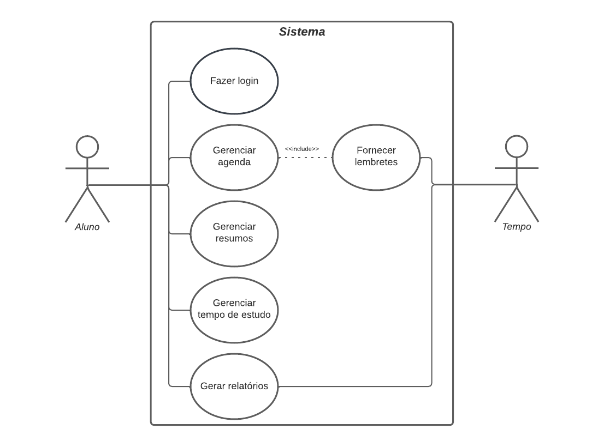

# Especificações do Projeto

Pré-requisitos: <a href="01-Documentação de Contexto.md"> Documentação de Contexto</a>

  
Nesta seção há a ideia de solução a partir da perspectiva do usuário, composta pelas personas, histórias de usuários, requisitos funcionais e não funcionais, além das restrições do projeto.

## Personas

Gisele Lima tem 25 anos e é programadora. Além de trabalhar, está fazendo pós-graduação em Ciências de Dados, e precisa de planejamento para dar conta do conteúdo do curso. Apesar de usar aplicativos de agenda digital, sente que seu planejamento de estudos acaba se perdendo entre compromissos de trabalho e pessoais. 

Juliana Dantas tem 17 anos e é estudante pré-vestibular. Motivada a tirar uma boa nota no ENEM e ingressar em uma universidade, assiste todas as aulas do cursinho, mas nem sempre consegue dar conta dos estudos quando está em casa. Ela busca métodos de organizar seu cronograma semanal para encaixar todas as matérias que precisa revisar. 

Paulo Freitas tem 33 anos e está em processo de transição de carreira. Possui uma rotina corrida, pois mora sozinho e trabalha em período integral. Além disso, como sua graduação é a distância, tem dificuldade de manter uma agenda e acaba perdendo prazos de provas e entregas de trabalhos. 

Raquel Soares tem 37 anos e é psicóloga. Buscando ser uma profissional atualizada, usa os horários livres entre seus atendimentos para ler e estudar sobre as novidades da área. Por ter pouco tempo e se interessar por muitos assuntos diferentes, acaba ficando sobrecarregada e se sentindo desmotivada frequentemente por ter dificuldade de se concentrar. 

## Histórias de Usuários

Com base na análise das personas forma identificadas as seguintes histórias de usuários:

|EU COMO... `PERSONA`| QUERO/PRECISO ... `FUNCIONALIDADE` |PARA ... `MOTIVO/VALOR`                 |
|--------------------|------------------------------------|----------------------------------------|
|Gisele Lima | De uma aplicação que centralize meu planejamento de estudos | Criar uma rotina de aprendizagem satisfatória |
|Juliana Dantas | Criar cronogramas de estudos | Conseguir dividir minha rotina semanal e estudar todas as matérias que preciso |
|Juliana Dantas | De ferramentas que me permitam criar metas de estudos e ver o meu desempenho | Para que eu possa me motivar dentro dos meus objetivos |
|Paulo Freitas | Organizar minha agenda | Não perder datas de provas e prazos importantes do meu curso |
|Raquel Soares | De uma ferramenta que me auxilie na concentração | Para que eu consiga aproveitar todo o tempo livre que possuo para meus estudos |

## Requisitos

As tabelas que se seguem apresentam os requisitos funcionais e não funcionais que detalham o escopo do projeto.

### Requisitos Funcionais

|ID    | Descrição do Requisito  | Prioridade |
|------|-----------------------------------------|----|
|RF-001| O sistema deve permitir cadastro e login de usuário. | ALTA |
|RF-002| O sistema deve permitir a edição dos dados cadastrais do usuário. | BAIXA |
|RF-003| O sistema deve permitir a recuperação de senha. | BAIXA |
|RF-004| O sistema deve permitir o controle e a organização de datas no calendário (eventos). | ALTA |
|RF-005| O sistema deve permitir a criação de cronograma semanal de estudos. | ALTA |
|RF-006| O sistema deve adequar as atividades dos cronogramas ao número de horas de estudo estipulado pelo usuário. | MÉDIA |
|RF-007| O sistema deve permitir o cadastro de metas de estudo | ALTA |
|RF-008| O sistema deve permitir ao usuário realizar sessões de estudo com base no método pomodoro. | BAIXA |
|RF-009| O sistema deve gerar notificações das datas importantes e metas a serem cumpridas. | BAIXA |
|RF-010| O sistema deve gerar relatório mostrando o andamento em relação às metas de estudo e dados sobre o tempo estudado. | BAIXA |

### Requisitos não Funcionais

|ID     | Descrição do Requisito  |Prioridade |
|-------|-------------------------|----|
|RNF-001| O sistema deve ser responsivo em diferentes dispositivos e tamanhos de telas. | ALTA |
|RNF-002| A aplicação deve ser compatível com os principais navegadores do mercado. | ALTA |
|RNF-003| O sistema deve permitir a leitura imersiva (acessibilidade). | MÉDIA |
|RNF-004| O sistema deve permitir verificação em duas etapas, recuperação/alteração de senha. | BAIXA |
|RNF-005| O sistema deve permitir o acesso aos dados e relatórios apenas ao respectivo usuário. | ALTA |
|RNF-006| O tempo de resposta do sistema não deve ultrapassar os 8 segundos. | ALTA |
|RNF-007| O back-end deverá ser desenvolvido na linguagem C#. | ALTA | 
|RNF-008| O projeto deverá ser entregue até o final do semestre. | ALTA |
|RNF-009| O projeto deverá ser executado apenas pelos alunos que compõe o grupo, sem contratação de profissionais. | ALTA |

## Restrições

O projeto está restrito pelos itens apresentados na tabela a seguir.

## Restrições e Regras de Gestão

|ID| Descrição da Regras de Gestão                     |Prioridade |
|--|---------------------------------------------------|----|
|RG-001| O sistema deve limitar o número de horas de estudo diárias no cronograma. | MEDIA |
|RG-002| O sistema deve restringir o cadastro de cronogramas com hora e data conflitantes. | ALTA |
|RG-003| O sistema deve exigir ao usuário o início e a finalização das sessões de estudo para cadastrá-las. | BAIXA |
|RG-004| O sistema deve permitir apenas um cadastro de usuário para cada e-mail. | ALTA |
|RG-005| O sistema deve realizar alteração de dados cadastrais apenas mediante a confirmação de senha do usuário. | ALTA |

## Diagrama de Casos de Uso

