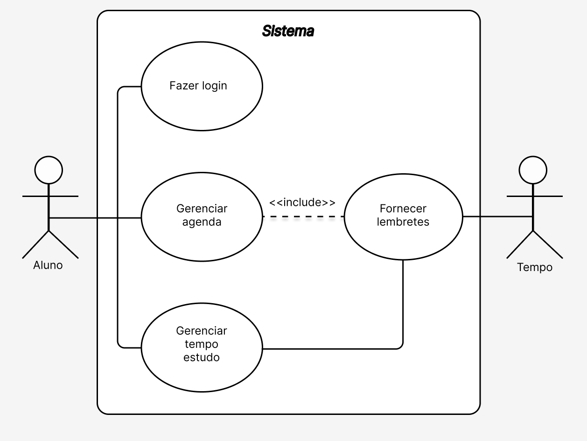

# Especificações do Projeto

Pré-requisitos: <a href="1-Documentação de Contexto.md"> Documentação de Contexto</a>

Definição do problema e ideia de solução a partir da perspectiva do usuário. É composta pela definição do  diagrama de personas, histórias de usuários, requisitos funcionais e não funcionais além das restrições do projeto.

Apresente uma visão geral do que será abordado nesta parte do documento, enumerando as técnicas e/ou ferramentas utilizadas para realizar a especificações do projeto.

## Personas

Gisele Lima tem 25 anos e é programadora. Além de trabalhar, está fazendo pós em Ciências de Dados, e precisa de planejamento para dar conta do conteúdo do curso. Apesar de usar aplicativos de agenda digital, sente que seu planejamento de estudos acaba se perdendo entre compromissos de trabalho e pessoais. 

Juliana Dantas tem 17 anos e é estudante pré-vestibular. Motivada a tirar uma boa nota no ENEM e ingressar em uma universidade, assiste todas as aulas do cursinho, mas nem sempre consegue dar conta dos estudos quando está em casa. Ela busca métodos de organizar seu cronograma semanal para encaixar todas as matérias que precisa revisar. 

Paulo Freitas tem 33 anos e está em processo de transição de carreira. Possui uma rotina corrida, pois mora sozinho e trabalha em período integral. Além disso, como sua graduação é a distância, tem dificuldade de manter uma agenda e acaba perdendo prazos de provas e entregas de trabalhos. 

Mário Júnior tem 22 anos e está cursando o terceiro período do curso de ADS. Seu objetivo é adquirir o máximo de conhecimento sobre programação web para se tornar um desenvolvedor. Embora se dedique bastante, tem dificuldade de organizar o conteúdo de seus estudos e, ao aprender sobre novas tecnologias, acaba esquecendo o que estudou anteriormente.  

Raquel Soares tem 37 anos e é psicóloga. Buscando ser uma profissional atualizada, usa os horários livres entre seus atendimentos para ler e estudar sobre as novidades da área. Por ter pouco tempo e se interessar por muitos assuntos diferentes, acaba ficando atolada e se sentindo desmotivada por frequentemente se perder na tarefa de escolher o que estudar e ter dificuldade de se concentrar. 

## Histórias de Usuários

Com base na análise das personas forma identificadas as seguintes histórias de usuários:

|EU COMO... `PERSONA`| QUERO/PRECISO ... `FUNCIONALIDADE` |PARA ... `MOTIVO/VALOR`                 |
|--------------------|------------------------------------|----------------------------------------|
|Gisele Lima | De uma aplicação que centralize meu planejamento de estudos | Criar uma rotina de aprendizagem satisfatória |
|Juliana Dantas | Criar cronogramas de estudos | Conseguir dividir minha rotina semanal e estudar todas as matérias que preciso |
|Paulo Freitas | Organizar minha agenda | Não perder datas de provas e prazos importantes do meu curso |
|Mário Júnior | De um espaço online onde eu consiga salvar anotações e resumos dos conteúdos estudados | Ter fácil acesso aos conteúdos quando precisar revisar, podendo pesquisar entre eles por data, temas e autores |
|Clara Silva | De ferramentas que me permitam criar metas de estudos e ver o meu desempenho| Para que eu possa me motivar dentro dos meus objetivos |
|Raquel Soares | De uma ferramenta que me auxilie na concentração | Para que eu consiga aproveitar todo o tempo livre que possuo para meus estudos |

## Requisitos

As tabelas que se seguem apresentam os requisitos funcionais e não funcionais que detalham o escopo do projeto.

### Requisitos Funcionais

|ID    | Descrição do Requisito  | Prioridade |
|------|-----------------------------------------|----|
|RF-001| O sistema deve permitir login de usuário. | ALTA |
|RF-002| O sistema deve permitir a recuperação de senha através de e-mail. | BAIXA |
|RF-003| O sistema deve permitir o controle e organização de datas no calendário. | ALTA |
|RF-004| O sistema não deve permitir que os conteúdos escolhidas para o cronograma se sobreponham ao número de horas de estudo estipuladas pelo usuário. | ALTA |
|RF-005| O sistema deve permitir o cadastro de metas de estudo. | BAIXA |
|RF-006| O sistema deve gerar notificações das datas importantes e metas a serem cumpridas. | BAIXA |
|RF-007| O sistema deve gerar relatório mostrando a porcentagem para conclusão de metas de estudos e dados sobre o tempo estudado. | BAIXA |

### Requisitos não Funcionais

|ID     | Descrição do Requisito  |Prioridade |
|-------|-------------------------|----|
|RNF-001| O sistema deve ser responsivo em diferentes dispositivos e tamanhos de telas. | ALTA |
|RNF-002| A aplicação deve ser compatível com os principais navegadores do mercado. | ALTA |
|RNF-003| O sistema deve permitir a leitura imersiva (acessibilidade). | MEDIA |
|RNF-004| O sistema deve permitir destacar/ocultar o conteúdo escolhido pelo usuário. | BAIXA | 
|RNF-005| O sistema deve permitir o salvamento automático. | MEDIA |
|RNF-006| O sistema deve possuir um limite de caracteres para o conteúdo registrado pelo usuário. | MEDIA |
|RNF-007| O sistema deve permitir verificação em duas etapas, recuperação/alteração de senha. | BAIXA |
|RNF-008| O sistema deve permitir o acesso aos dados e relatórios apenas ao respectivo usuário. | ALTA |
|RNF-009| O tempo de resposta do sistema não deve ultrapassar os 8 segundos. | ALTA |
|RNF-010| O back-end deverá ser desenvolvido na linguagem C#. | ALTA | 
|RNF-011| O projeto deverá ser entregue até o final do semestre. | ALTA |
|RNF-012| O projeto deverá ser executado apenas pelos alunos que compõe o grupo, sem contratação de profissionais. | ALTA |

## Restrições

O projeto está restrito pelos itens apresentados na tabela a seguir.

|ID| Descrição da Restrição                |Prioridade |
|--|---------------------------------------------------|----|
|01| O sistema deve permitir um limite máximo de caracteres para anotações. | Média |

## Regras de Gestão

|ID| Descrição da Regras de Gestão                     |Prioridade |
|--|---------------------------------------------------|----|
|RG-001| O sistema deve limitar o número de matérias diário. | ALTA |
|RG-002| O sistema deve requerer ao usuário a finalização do cronograma a ser seguindo. | ALTA |
|RG-003| O controle e representação de prazos no projeto deverá utilizar Gantt. | ALTA |

## Diagrama de Casos de Uso

