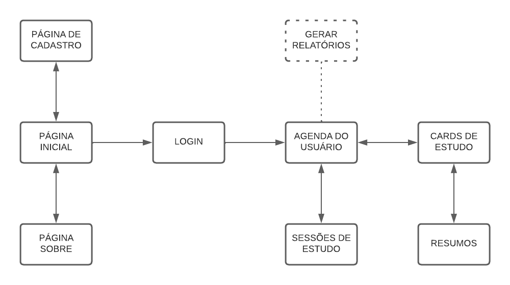

# Projeto de Interface

Pré-requisitos: <a href="2-Especificação do Projeto.md"> Documentação de Especificação</a>

 
Nesta seção há uma visão geral da interação do usuário pelas telas do sistema e um protótipo interativo das telas com as funcionalidades que fazem parte do sistema (wireframes).

A interface da plataforma foi pensada de forma a atender os requisitos funcionais, não funcionais e histórias de usuário abordados nas <a href="2-Especificação do Projeto.md"> Documentação de Especificação</a>.

## Diagrama de Fluxo

 
O diagrama apresenta o estudo do fluxo de interação do usuário com o sistema interativo. Antes de realizar o login, o usuário pode acessar a página inicial e a página "Sobre" da aplicação. Após o cadastro e login o usuário é direcionado para as páginas de gerenciamento de agenda, cards e sessões de estudo, além de acessar relatório gerado pelo sistema, como desenhado abaixo:

## Wireframes

Home page:

 

Login:
 

PopUp para cadastro de novo usuário:
 

Menu principal:

Agenda:

PopUp para cadastro de novo evento:

PopUp para cadastro de agenda:

Pomodoro e controlhe do tempo diário:

PopUp para personalizar os ciclos de estudo:

Página para gerar relatórios:

Tela de Cards do usuário:

Conteúdo dentro dos cards:

Tela de Resumos:

Conteúdo dentro do Resumo:

Sobre:

