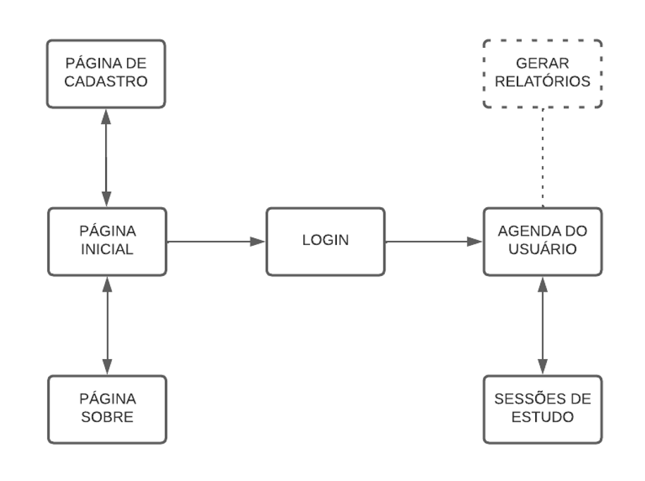

# Projeto de Interface

Pré-requisitos: <a href="2-Especificação do Projeto.md"> Documentação de Especificação</a>

 
Nesta seção há uma visão geral da interação do usuário pelas telas do sistema e um protótipo interativo das telas com as funcionalidades que fazem parte do sistema (wireframes).

A interface da plataforma foi pensada de forma a atender os requisitos funcionais, não funcionais e histórias de usuário abordados nas <a href="2-Especificação do Projeto.md"> Documentação de Especificação</a>.

## Diagrama de Fluxo

 
O diagrama apresenta o estudo do fluxo de interação do usuário com o sistema interativo. Antes de realizar o login, o usuário pode acessar a página inicial e a página "Sobre" da aplicação. Após o cadastro e login o usuário é direcionado para as páginas de gerenciamento de agenda e sessões de estudo, como desenhado abaixo:

## Wireframes

**Homepage:**

**Login:**

**Cadastro de  usuário:**
 

**Agenda:**

**Cadastro de evento:**

**Sessão de estudo - Pomodoro:**

**Sobre:**

