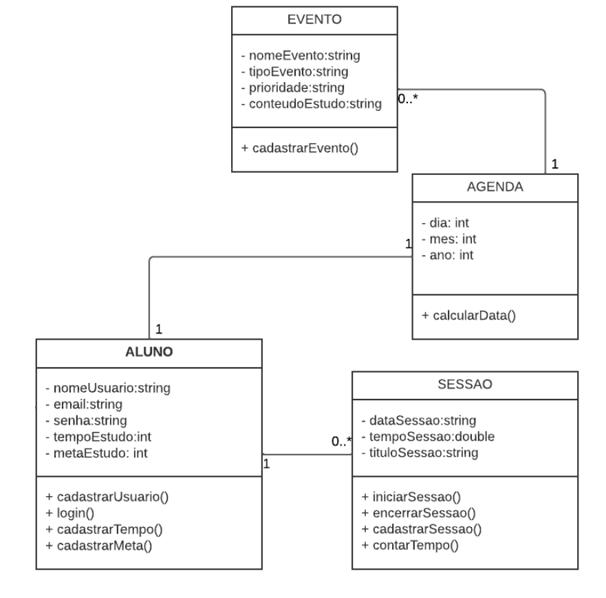

# Arquitetura da Solução

Pré-requisitos: <a href="3-Projeto de Interface.md"> Projeto de Interface</a>

Nesta seção é definida a estrutura do software em termos dos componentes que fazem parte da solução e do ambiente de hospedagem da aplicação.

## Diagrama de Classes

 
O diagrama de classes ilustra graficamente como será a estrutura do software, e como cada uma das classes da sua estrutura estarão interligadas. Essas classes servem de modelo para materializar os objetos que executarão na memória.

Aluno se refere ao usuário da aplicação, que cria/gerencia sua agenda e sessões de estudo.

## Modelo ER (Projeto Conceitual)

O Modelo Entidade-Relacionamento representa através de um diagrama como as entidades (coisas, objetos) se relacionam entre si na aplicação interativa.

## Projeto da Base de Dados

O projeto da base de dados corresponde à representação das entidades e relacionamentos identificadas no Modelo ER, no formato de tabelas, com colunas e chaves primárias/estrangeiras necessárias para representar corretamente as restrições de integridade.

## Tecnologias Utilizadas e Hospedagem

 - IDEs de desenvolvimento: Visual Studio Code e Visual Studio 2022;
 - Linguagens utilizadas: HTML, CSS, JavaScript, C# e SQL;
 - Ferramenta de design: Figma;
 - Ferramenta de Diagramação: Lucidchart;
 - Ferramenta de versionamento: Git;
 - Ferramenta de Gestão de Projeto: Github Projects;
 - Plataforma para hospedagem do Site: Github Pages.

<!--
 - Ferramentas de modelagem do banco de dados: [MySQL Workbench](https://www.mysql.com/products/workbench/);
 - Framework de ORM: [Entity](https://learn.microsoft.com/en-us/ef/);
 - Plataforma para hospedagem do banco de dados: [Microsoft SQL Server (Azure)](https://azure.microsoft.com/pt-br/products/azure-sql/?culture=pt-br&country=br#product-overview);

> **Links Úteis**:
>
> - [Website com GitHub Pages](https://pages.github.com/)
> - [Programação colaborativa com Repl.it](https://repl.it/)
> - [Getting Started with Heroku](https://devcenter.heroku.com/start)
> - [Publicando Seu Site No Heroku](http://pythonclub.com.br/publicando-seu-hello-world-no-heroku.html)
-->
