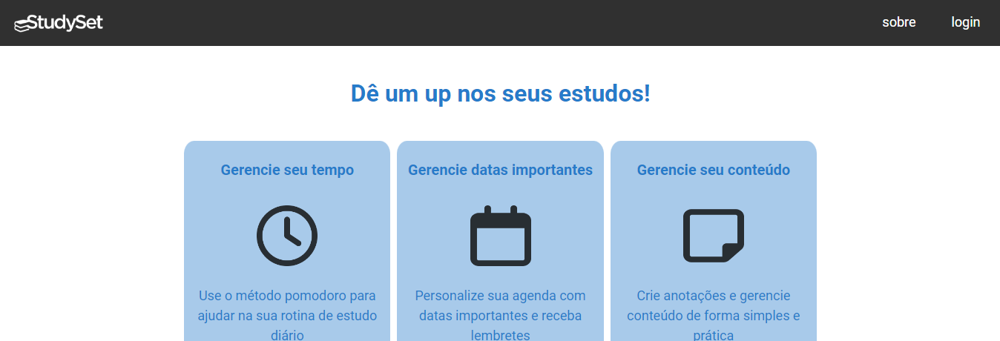
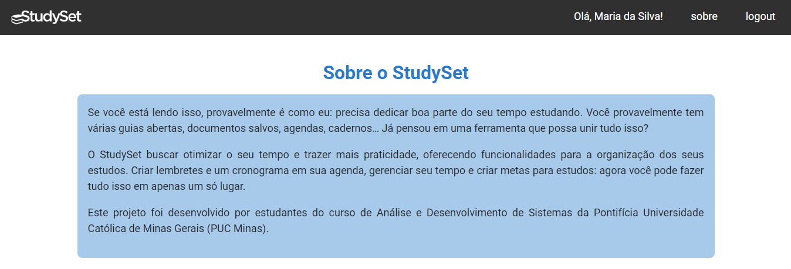
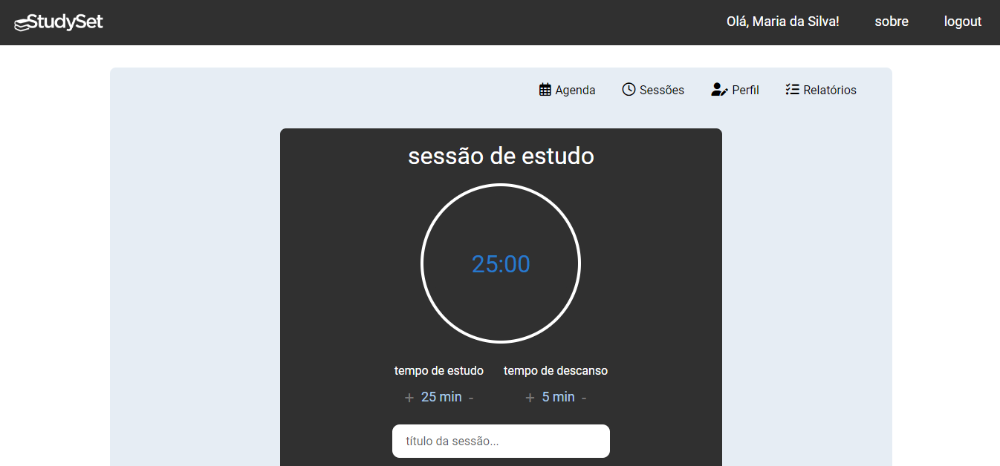
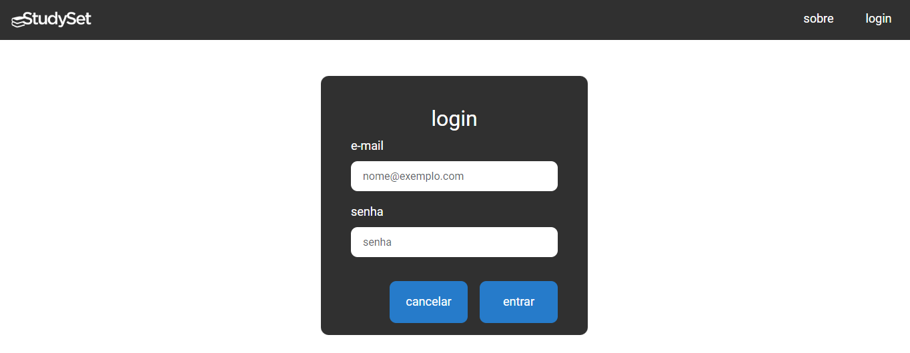

# Template Padrão da Aplicação

Pré-requisitos: <a href="2-Especificação do Projeto.md"> Especificação do Projeto</a>, <a href="3-Projeto de Interface.md"> Projeto de Interface</a>, <a href="4-Metodologia.md"> Metodologia</a>

 
  
A seguir, são apresentados os componentes do template padrão e o layout que compõem a identidade visual da aplicação. Os principais elementos são: navbar, menu interno, formulários e botões - todos com padrão Bootstrap. A paleta de cores do Studyset é composta por diferentes tons de azul, branco, preto e cinza. Por padrão, os títulos são escritos em letras minúsculas.

## Navbar

  
A navbar do site conta com duas versões: para usuários não autenticados e para usuários autenticados. Ambas possuem por padrão a logo do Studyset à esquerda - que leva à homepage - e o caminho para a página "Sobre" à esquerda. Ao acessar o site pela primeira vez, antes de realizar autenticação, há no canto direito o link para fazer login:

 

 
  
Após o login, a navbar passa a ter uma mensagem de boas vindas com o nome do usuário e o botão de login é substituído pelo botão de logout. Além disso, a logo à esquerda da navbar não direciona mais para a página inicial, onde é realizado o cadastro, mas sim para a página de Agenda, que é considerada a homepage do usuário logado.

## Menu interno

  
Depois que o usuário já está autenticado e passa a ter acesso às funcionalidades da aplicação, o conteúdo das páginas passa a ser encapsulada por um container onde há, à direita, os links que direcionam para as demais páginas:

## Formulários e botões

Seguindo a paleta de cores do projeto, os formulários possuem fundo cinza e os botões fundo azul, para constrastar. As bordas de ambos os elementos são arredondadas, e os textos são escritos em caixa baixa:

