# Registro de Testes de Software

Pré-requisitos: <a href="04-Projeto de Interface.md"> Projeto de Interface</a>, <a href="08-Plano de Testes de Software.md"> Plano de Testes de Software</a>

  
Para cada caso de teste definido no Plano de Testes de Software, foi realizado o registro das evidências dos testes feitos na aplicação pela equipe.

| CT a serem avaliados: |
| :---	|
| CT-001: Cadastro e acesso de usuário |
| CT-002: Edição dos dados cadastrais do usuário	|
| CT-003: Recuperação de senha |
| CT-004: Gerenciamento de datas na agenda |
| CT-005:  Criação de cronograma semanal |
| CT-006:  Adequação do tempo de estudo no cronograma |
| CT-007:  Cadastro de meta de estudo |
| CT-008:  Realização de sessão de estudo |
| CT-009:  Notificação de eventos |
| CT-0010:  Visualização de progresso |

| **Caso de Teste**| **CT-001: Cadastro e acesso de usuário** |
| :--- | :---: |
| Pré-condições | Estar na  homepage |
| Procedimentos (passo à passo) | 1. Acessar a página de cadastro a partir da homepage do site   2. Preencher os dados do formulário seguindo as respectivas validações   3. Submeter o cadastro   4. Deslogar após o cadastro   5. Realizar o login com os dados cadastrados nas etapas anteriores |
| Dados de entrada | Inserir - Nome: Maria da Silva; E-mail: mariadasilva@gmail.com; Senha: S3nh@daMaria |
| Resultado esperado | Validação de dados; Cadastro e login bem sucedidos |
| Avaliação | O sistema validou os dados tanto no cadastro quanto login. Quando corretos, os dados permitiram cadastro e login bem sucedidos |
| Evidência | 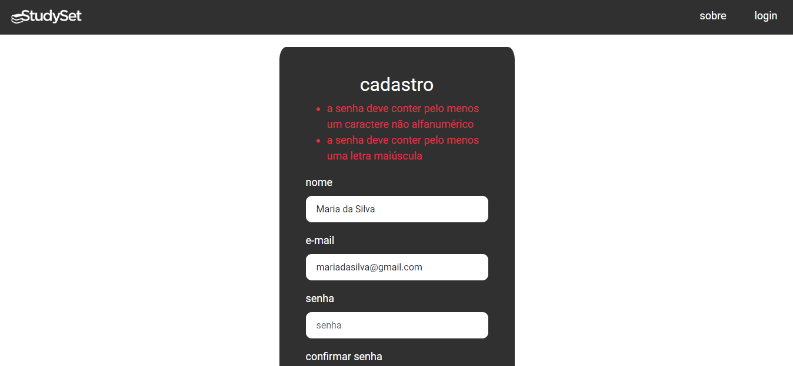   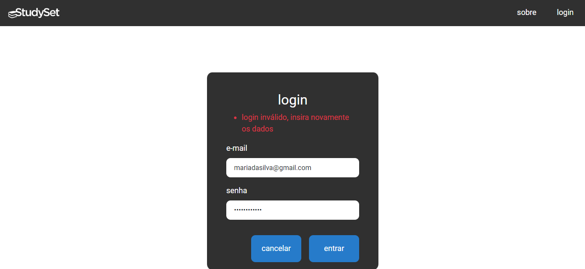   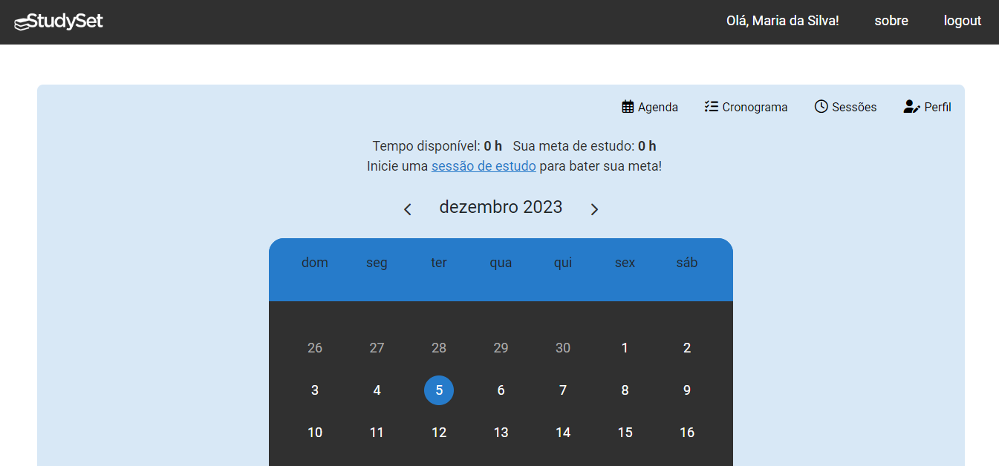 |

| **Caso de Teste** | **CT-002: Edição dos dados cadastrais do usuário** |
| :--- | :---: |
| Pré-condições | Acessar a página de perfil do usuário |
| Procedimentos (passo à passo) | 1. Acessar a página de perfil do usuário   2. Editar os dados de perfil (nome, tempo disponível e/ou meta de estudo)   3. Acessar a página de edição de dados   4. Editar e-mail e/ou senha do usuário |
| Resultado esperado | Validação de dados; Confirmação de senha; Edição de dados de cadastro com êxito |
| Avaliação | O sistema validou os dados inseridos e não permitiu alteração de e-mail e senha sem a confirmação correta das credenciais. Após cadastro correto, os dados foram salvos |
| Evidência | 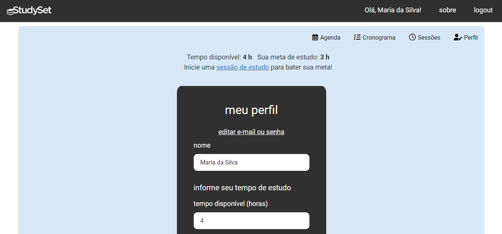   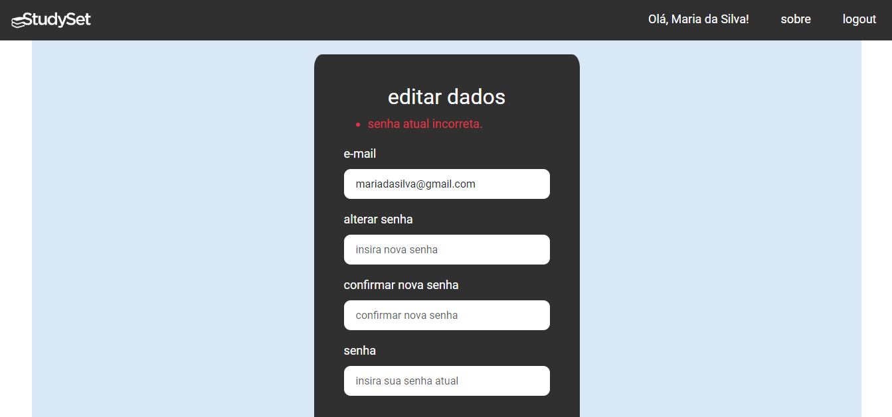 |

| **Caso de Teste**| **CT-003:Recuperação de senha** |
| :--- | :---: |
| Pré-condições| Acessar a página de login|
| Procedimentos (passo à passo) | 1. Acessar a página de login   2. Clicar em recuperar senha   3. Inserir e-mail do usuário   4. Verificar o recebimento do protocolo |
| Resultado esperado | - O usuário deve receber o protocolo de recuperação de senha   - A senha deve ser recuperada com êxito | 
| Avaliação | Não implementado |
| Evidência | Não implementado |

| **Caso de Teste** | **CT-004:  Gerenciamento de datas na agenda** |
| :--- | :---: |
| Pré-condições |  Acessar a página de agenda do usuário  |
| Procedimentos (passo à passo) | 1. Acessar a página de agenda do usuário   2. Adicionar novo evento   3. Verificar a inclusão do evento na lista   4. Verificar a marcação das datas de eventos no calendário   5. Deletar um evento cadastrado |
| Resultado esperado | Validação de dados; Cadastro de eventos com êxito; O evento cadastrado deve aparecer na lista e as datas com eventos devem aparecer em destaque no calendário; Deve ser possível deletar os itens cadastrados |
| Avaliação | O sistema validou os dados e cadastrou corretamente o evento. O evento apareceu na lista e sua data foi marcada no calendário. Após confirmação, foi possível deletar o evento. |
| Evidência | 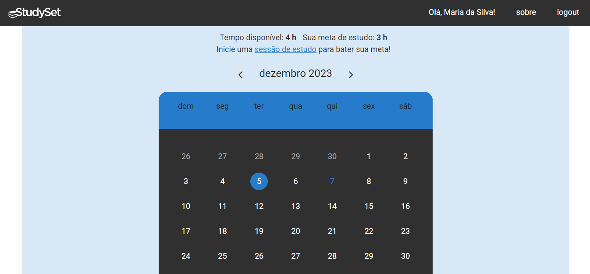   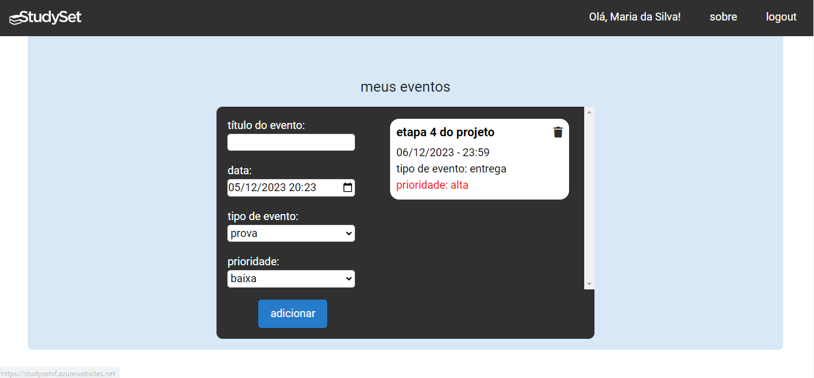   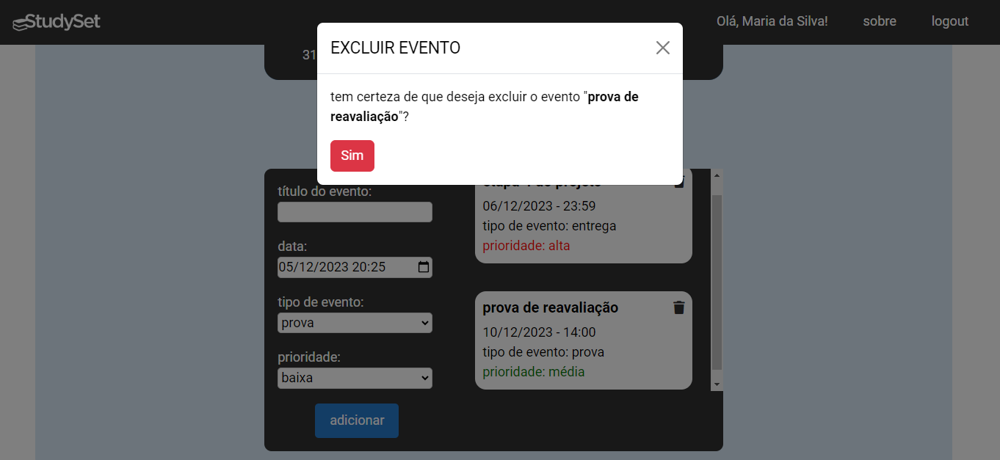 |

| **Caso de Teste** | **CT-005:  Criação de cronograma semanal** |
| :--- | :---: |
| Pré-condições | Acessar a página de cronograma do usuário  |
| Procedimentos (passo à passo) | 1. Acessar a página de cronograma do usuário   2. Cadastrar itens ao cronograma   3. Verificar a inclusão dos itens no dia da semana correspondente   4. Deletar um item de cronograma cadastrado |
| Resultado esperado | Cadastro de cronograma com êxito; O item cadastrado deve aparecer no dia correto da semana; Deve ser possível deletar os itens cadastrados |
| Avaliação | Os itens foram cadastrados no dia da semana correto. Após confirmação, foi possível apagar o item do cronograma.|
| Evidência | 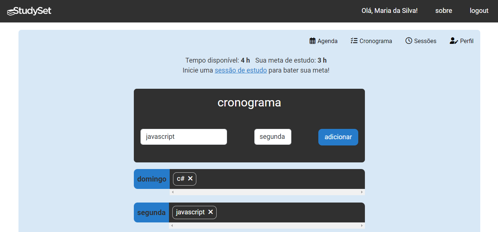   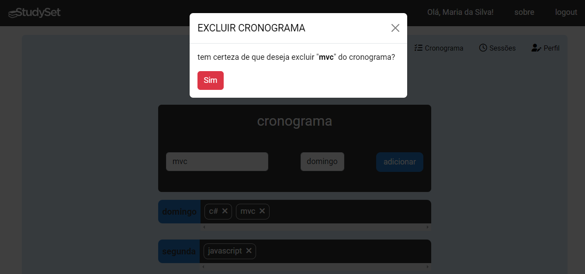 |

| **Caso de Teste**| **CT-006:  Adequação do tempo de estudo no cronograma** |
| :--- | :---: |
| Pré-condições | Verificar se o tempo disponível está cadastrado no perfil do usuário  |
| Procedimentos (passo à passo) | 1. Verificar se o tempo disponível está cadastrado no perfil do usuário   2. Acessar a página de cronograma do usuário   3. Cadastrar itens de cronograma   4. Verificar se a aplicação impede o cadastro de cronograma que se sobreponha ao tempo disponível para estudo |
| Dados de entrada | Tempo disponivel: 4 horas |
| Resultado esperado | O sistema deve impedir o cadastro de cronograma inadequado |
| Avaliação | O sistema não permitiu cadastrar mais itens quando o cronograma estava maior que o tempo disponível do usuário. |
| Evidência | 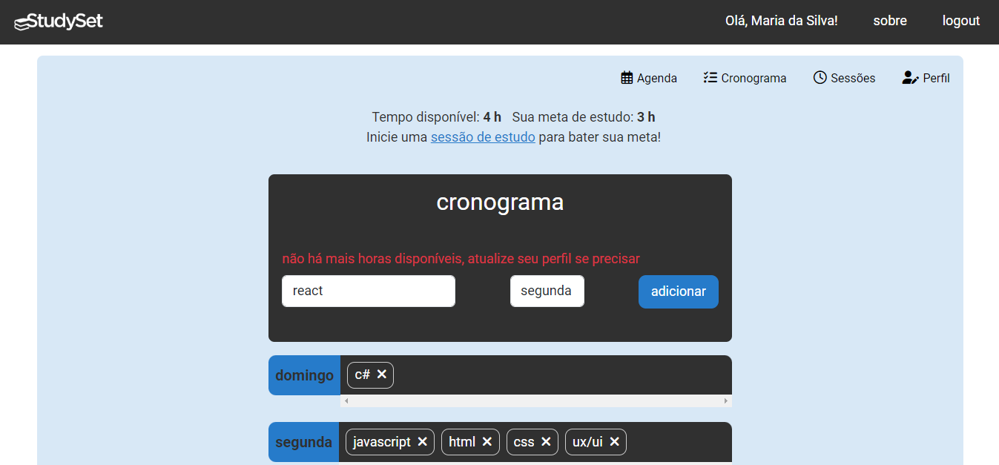 |

| **Caso de Teste**| **CT-007: Cadastro de meta de estudo** |
| :--- | :---: |
| Pré-condições | Acessar a página de perfil do usuário  |
| Procedimentos (passo à passo) | 1. Acessar a página de perfil do usuário   2. Inserir a meta de estudo |
| Resultado esperado | Cadastro de meta de estudo com êxito; O sistema deve impedir o cadastro de meta maior que o tempo disponível do usuário |
| Avaliação | O sistema validou a meta de acordo com o tempo disponível do usuário. Quando adequada, a meta foi cadastrada corretamente. |
| Evidência | 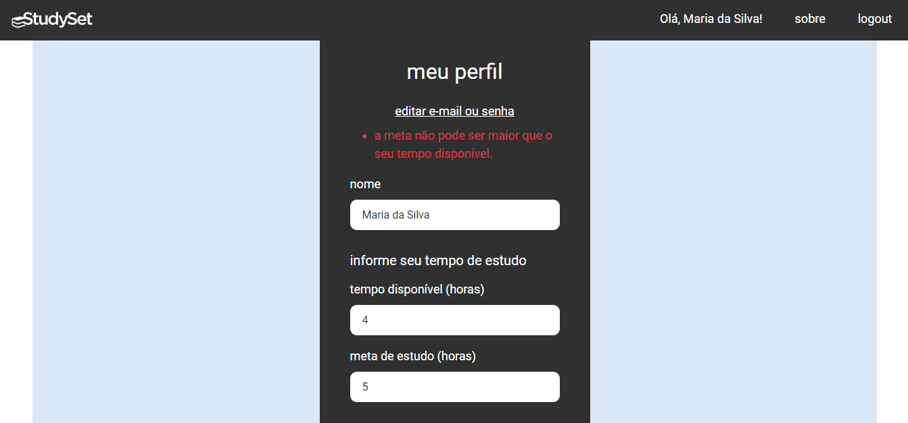 |

| **Caso de Teste**| **CT-008: Realização de sessão de estudo** |
| :--- | :---: |
| Pré-condições | Acessar a página de perfil do usuário  |
| Procedimentos (passo à passo) |  1. Acessar a página de sessão de estudo do usuário   2.  Ajustar o tempo de estudo e descanso no timer   3. Inserir o título da sessão   4. Iniciar a sessão   5. Pausar a sessão   6. Verificar se a sessão aparece no histórico |
| Resultado esperado | A sessão deve ser realiza com o tempo escolhido; A sessão realizada deve constar no histórico |
| Avaliação |A sessão de estudos foi realizada com o tempo escolhido e, ao encerrada, foi cadastrada e apareceu no histórico de sessões. No entanto, após apagar a sessão, não foi mais possível cadastrar novas. |
| Evidência | 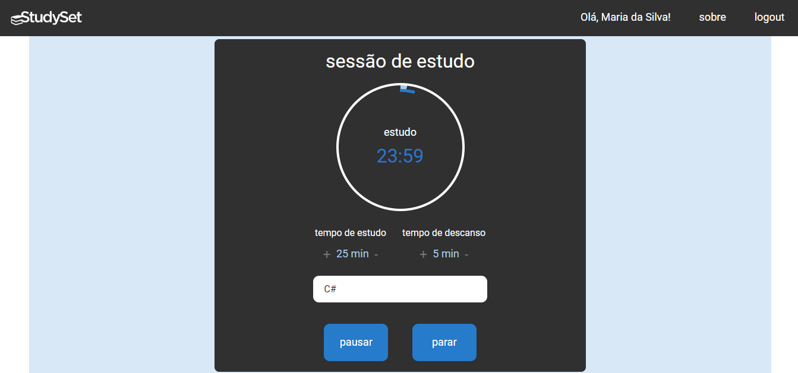   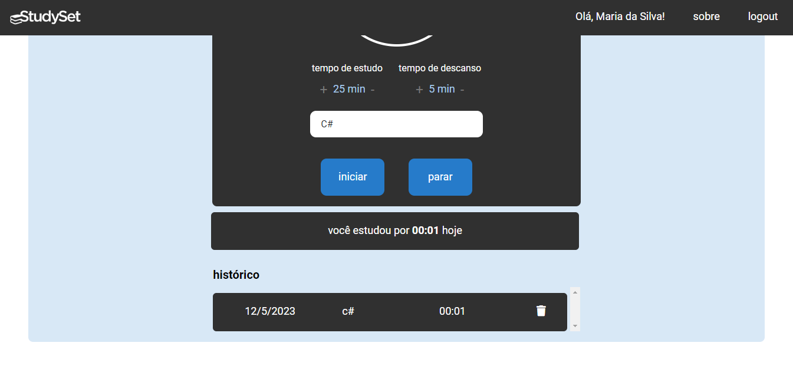 |

| **Caso de Teste**| **CT-009:  Notificação de eventos** |
| :--- | :---: |
| Pré-condições | Acessar a página de agenda do usuário  |
| Procedimentos (passo à passo) |  1. Acessar a página de agenda do usuário   2. Verificar se as datas de eventos aparecem marcadas no calendário   3. Verificar se os eventos são exibidos em lista com marcação do tipo e prioridade do evento |
| Resultado esperado | As datas com eventos devem estar destacadas no calendário e, na lista, com marcação do tipo e prioridade |
| Avaliação | As datas dos eventos cadastrados apareceram em destaque no calendário e, na lista, foi destacada em cores a prioridade de cada evento. |
| Evidência |    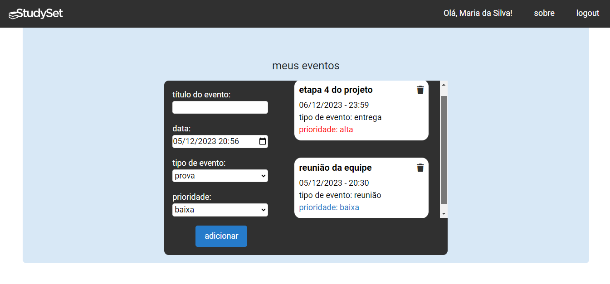 |

| **Caso de Teste**| **CT-010:   Visualização de progresso** |
| :--- | :---: |
| Pré-condições | Acessar qualquer página do usuário  |
| Procedimentos (passo à passo) | 1. Acessar qualquer página do usuário   2. Verificar se são mostrados os dados em relação ao tempo disponível e meta de estudo em lugar acessível   3. Acessar a página de sessão de estudo do usuário   4. Verificar se é mostrado junto ao histórico geral a quantidade de tempo estudado no dia |
| Resultado esperado | Os dados devem aparecer em local visível nas páginas; O tempo estudado no dia deve ser calculado e mostrado na página de sessão |
| Avaliação | Os dados referentes ao tempo e meta de estudos do usuário foram mostrados no topo de todas as páginas. Na página de sessão, foi possível ver o tempo estudado no dia. |
| Evidência |     |

## Avaliação

Discorra sobre os resultados do teste. Ressaltando pontos fortes e fracos identificados na solução. Comente como o grupo pretende atacar esses pontos nas próximas iterações. Apresente as falhas detectadas e as melhorias geradas a partir dos resultados obtidos nos testes.

> **Links Úteis**:
> - [Ferramentas de Test para Java Script](https://geekflare.com/javascript-unit-testing/)
